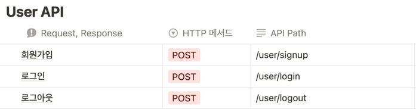
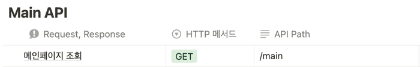
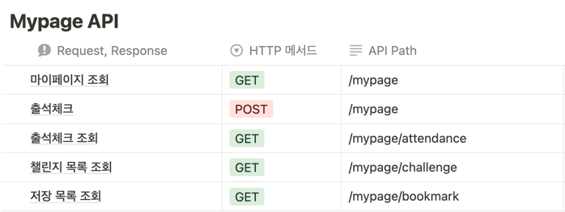
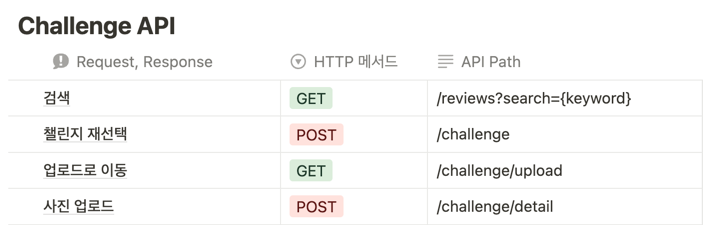
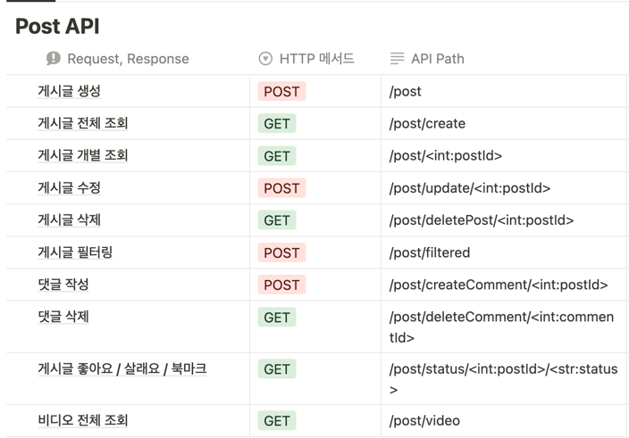

## 🌿 Green Hero

```
<Green Hero>는 업사이클링 아이디어 공유부터 판매까지의 과정에 도움을 주는 서비스 입니다.
```

업사이클링을 통해 환경 보전이라는 목적를 이루려는 서비스는 이미 많이 존재하지만 접근성이 떨어지고 지속적인 참여가 어려우며 실질적 자원순환에는 도움이 되지 않습니다.

하지만 Green Hero는
게시글과 숏폼을 통한 아이디어 공유부터 살래요 버튼을 통해 예상 구매자를 확보하여 실 제작 및 판매가 성공적으로 이루어지도록 도움을 줄 수 있습니다.

<br>

## 🌿 팀소개
<table border="" cellspacing="0" cellpadding="0" width="100%">
  <tr width="100%">
    <td align="center">권지민</a></td>
    <td align="center">박서연</a></td>
    <td align="center">이정아</a></td>
    <td align="center">이태연</a></td>
    <td align="center">최유신</a></td>
  </tr>
  <tr width="100%">
  <td align="center"></td>
  <td align="center"></td>
  <td align="center"></td>
  <td align="center"></td>
  <td align="center"></td>
  </tr>
  <tr width="100%">
  <td  align="center">프론트엔드</td>
    <td  align="center">프론트엔드</td>
  <td  align="center">백엔드</td>
  <td  align="center">백엔드</td>
    <td  align="center">백엔드</td>
     </tr>
      <tr width="100%">
     </tr>
  </table>  

<br>


<span>Front End :</span> 
<span></span>
<span></span>
<span></span>

<span>Back End: </span>
<span></span>
<span></span>

<span>Environment: </span>
<span></span>
<span></span>
<span></span>
<span></span>

<span>Communication: </span>
<span></span>

<span>Design: </span>
<span></span>

## 🌿 실행 방법
```
#가상환경 설치
python -m venv venv (Window)
virtualenv -p python3 venv (Mac)

#가상환경으로 들어가기
.\venv\Scripts\activate (Window)
source venv/bin/activate (Mac)

#장고설치
pip install django~=3.2.10 

#마이그레이션
python manage.py makemigrations
python manage.py migrate

#가상환경 실행
python manage.py runserver

#가상환경 종료
ctrl + c
```

## 🌿기능 설명

### **업사이클링 아이디어 게시글 업로드**
자신이 재활용하여 만든 물품을 글, 사진, 동영상을 통해 게시하고, 다른 사용자가 해당 게시글이 마음에 들면 좋아요,살래요 버튼을 눌러 평가할 수 있습니다.

### **숏 폼 기능**
아이디어 공유를 동영상으로 한 경우 숏 폼을 통해 쉽게 스크롤하며 동영상들을 확인하고 좋아요, 살래요 버튼을 사용할 수 있습니다. 

### **챌린지 및 출석**
꾸준한 서비스의 활용을 위해 매일 출석 체크하여 보상을 얻을 수 있고, 매일 변경되는 챌린지를 통해 성공 시 보상을 획득 할 수 있다.

### **살래요**
게시글에 살래요 버튼을 눌러 사고싶다는 의사를 나타내고, 살래요의 수를 통해 순위를 산출하여 상위권 사용자에게 해당 제품을 실제로 제작 및 판매할 수 있도록 도움을 줍니다.


## 🌿API 명세서






